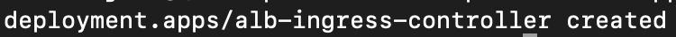
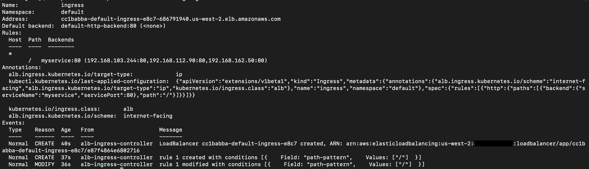

## Serverless Kubernetes: AWS EKS on Fargate

**Introduction**

Amazon is investing more effort into their serverless stack and this functionality will allow us to run Kubernetes in a “serverless” mode. I am thrilled about being able to run Kubernetes pods in Fargate as this minimizes the overhead to run Kubernetes applications and there is zero need to run any EC2 worker nodes.

This article will cover the following topics:

- Deploy EKS on AWS Fargate
- Deploy Application Load Balancer on AWS Fargate

**AWS Fargate**
 AWS Fargate allows us to build and deploy containerized applications without worrying about underlying infra and it also reduces a lot of the overhead involved with deploying applications. 

**AWS Elastic Kubernetes Service (EKS)**
 EKS is Amazon’s fully managed Kubernetes Service that allows running Kubernetes on AWS without managing the control plane and it also reduces a lot of the overhead involved with having to manage and run the control plane.

**How to setup an EKS cluster on Fargate**

***Prerequisites***
 The following tools we will be leverage for this demo:
- <a href="https://docs.aws.amazon.com/eks/latest/userguide/eksctl.html">eksctl</a>: Official CLI to create a new EKS cluster.
- <a href="https://docs.aws.amazon.com/eks/latest/userguide/install-kubectl.html">kubectl</a>: Kubernetes uses a command line utility called kubectl for communicating with the cluster API server.

***Setting up***

- Deploy EKS on AWS Fargate
  - Below command will deploy an EKS cluster named demo-cluster with Fargate enabled. It will take roughly 15-20 minutes to completely deploy the cluster so hold on until the process finishes.
      
        eksctl create cluster --name demo-cluster --version 1.18 --region us-east-2 --fargate --alb-ingress-access
  - A deeper look into the command we ran above:
    - name: specify the name of the cluster you want example demo-cluster
    - region: AWS region you want to deploy the cluster example us-west-2
    - fargate: it will create a Fargate profile, which is used to run pods as Fargate tasks and this profile has permission to the default and kube-system namespaces
    - ALB ingress access: EKS on Fargate only supports the ALB and this flag will enable few configurations required to deployed ALB to work with Fargate.
  - If everything is green then you will see the below output:
    - EKSCTL command output
       
      
    - AWS Cloudformation console output
       
      
    - AWS EKS console output
       
      
  - Let's verify the cluster and fetch the node details 
      
         kubectl get nodes
    
    

- Deploy Application Load Balancer on AWS Fargate
  - In this step, we will provide the AWS ALB Ingress controller to allow external traffic accessibility for our application
    - First, we will deploy the rbac_role manifest and it will grant required permissions to the ALB ingress controller to interact with the cluster we deployed.
    
          kubectl apply -f rbac-role.yaml
     
     
    
    - Next, we need to deploy the ALB ingress controller but before that, we need to edit and update few details in the alb-ingress-controller.yaml file
        - cluster-name: name of the EKS cluster 
        - vpc-id: VPC ID of the EKS cluster
        - aws-region: The region for your EKS cluster 
        - AWS_ACCESS_KEY_ID: The AWS access key id that ALB controller can use to communicate with AWS 
        - AWS_SECRET_ACCESS_KEY: The AWS secret access key id that ALB controller can use to communicate with AWS 
        Note: for a production setup, it is recommended to use a project like kube2iam for providing IAM Access  
     - Now we will deploy the ALB ingress controller that will create an Ingress Controller required by ALB
          
            kubectl apply -f alb-ingress-controller.yaml
       
       
       
      - Let's verify the output 
             
             kubectl logs -n kube-system $(kubectl get po -n kube-system | egrep -o "alb-ingress[a-zA-Z0-9-]+")

       
      
      - Next, we will create the deployment for the application:
             
             kubectl apply -f deployment.yaml
         
         
       
      - Then, we create a service for our application:
      
            kubectl apply -f nodeport.yaml
         
         
       
       - Finally, we will deploy the ingress to expose our application to the public internet.
       
             kubectl apply -f ingress.yaml 
         
         
        
       - Let's check the status of the ingress with the below command and note the Address in the output section will be the public URL for our application
       
              kubectl describe ing ingress
         
         

       - AWS ALB console output
       
          

       - Enter the public URL for our application in the browser and verify 
       
          

- Let's wrap-up and clean all the resources 
  - Execute below command to delete Fargate and associate resources 
    
        eksctl delete cluster --name demo-cluster --region us-west-2
      
     
     
